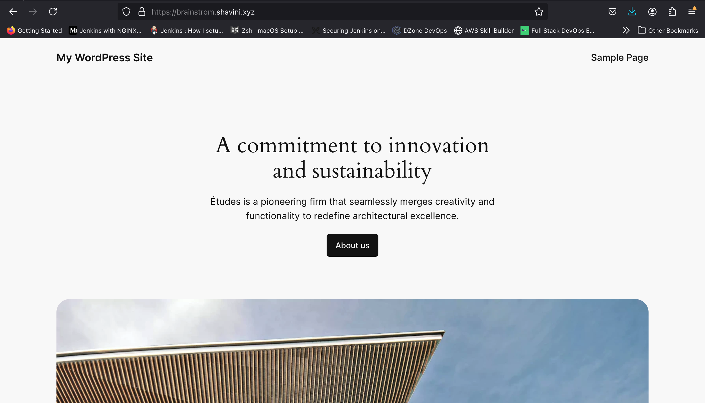
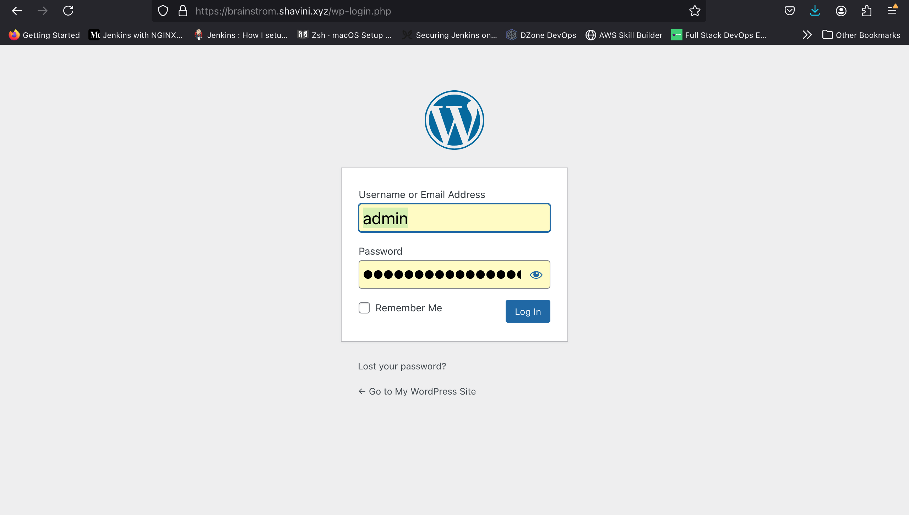
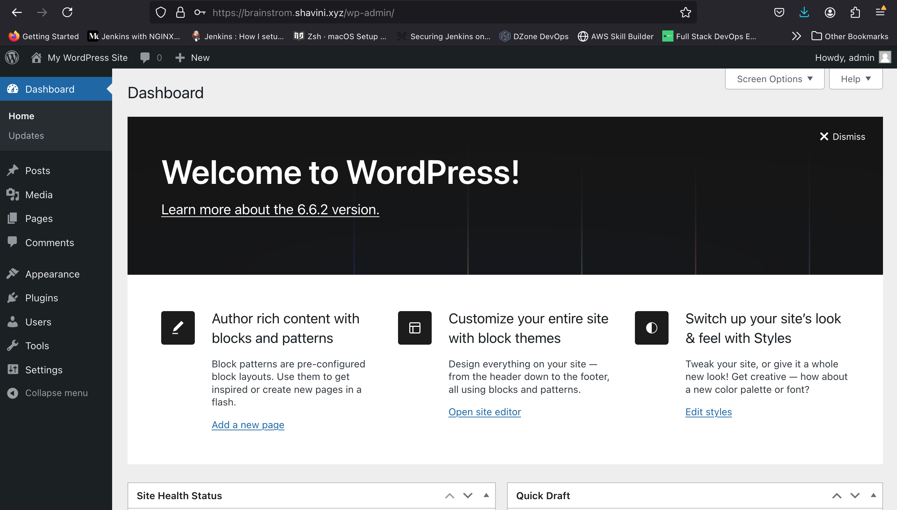

# BrainstromForce
Assignment 

This project automates the deployment of a WordPress website using the LEMP stack (Linux, Nginx, MySQL, PHP) with GitHub Actions for CI/CD. It follows best practices for security and performance.

## Project Setup

- **Web Server**: Nginx
- **Database**: MySQL/MariaDB
- **Scripting Language**: PHP
- **Automation**: GitHub Actions

### Goals

- Secure, optimized deployment of WordPress on a VPS
- Automated CI/CD with GitHub Actions
- SSL/TLS configuration using Let's Encrypt
- Optimized Nginx for caching and performance

## WordPress Deployment with Terraform and GitHub Actions

This project automates the deployment of a WordPress website on an AWS EC2 instance using Terraform and GitHub Actions for CI/CD. The setup includes an Nginx web server, MySQL database, PHP configuration, and SSL via Let’s Encrypt.

# Table of Contents

	•	Prerequisites
	•	Project Setup
	•	Terraform Configuration
	•	GitHub Actions Setup
	•	Security and Best Practices
	•	Notes

# Prerequisites

	1.	AWS Account: Ensure you have an AWS account and IAM user credentials with permissions to manage EC2, Route 53, and security groups.
	2.	Terraform: Install Terraform on your local machine. Installation Guide.
	3.	GitHub Repository: Create a GitHub repository for the project, with Secrets configured for secure deployment.

# Project Setup

	1.	Clone the Repository:
    
    git clone https://github.com/your-username/your-repo-name.git
    cd your-repo-name
    
	2.	Create and Configure terraform.tfvars:
    Add the following variables in terraform.tfvars file to define the environment:
    aws_region            = "us-east-1"
    aws_region            = "us-east-1"
    ami_id                = "ami-005fc0f236362e99f"
    instance_type         = "t2.micro"
    ssh_key_name          = "your-key-pair-name"
    ssh_cidr_block        = "your-ip-range"
    mysql_root_password   = "secure-root-password"
    php_version           = "8.1"
    wordpress_db_name     = "wordpress_db"
    wordpress_db_user     = "wp_user"
    wordpress_db_password = "wp_password"
    wordpress_site_title  = "My WordPress Site"
    wordpress_admin_user  = "admin"
    wordpress_admin_password = "admin_password"
    wordpress_admin_email = "your-email@example.com"
    wordpress_url         = "brainstrom.shavini.xyz"
    route53_zone_id       = "yourzoneid"

	3.	Initialize Terraform:
    terraform init

    terraform plan  -auto-approve -var=terraform.tfvars

    4.	Apply Terraform Configuration:
    Deploy the infrastructure on AWS.
    terraform apply -auto-approve -var=terraform.tfvars
    5.	Outputs:
        After deployment, Terraform provides outputs like instance_id, public_ip, and instance_private_ip. Use these to access and manage the WordPress site.
## Terraform Configuration

# The Terraform configuration includes:
	•	Security Groups: Opens ports 22 (SSH), 80 (HTTP), and 443 (HTTPS) with customizable CIDR ranges.
	•	EC2 Instance: Deploys the instance with Nginx, MySQL, and PHP installed.
	•	Elastic IP: Provides a consistent public IP.
	•	Route 53 Record: Creates a DNS A record for the specified domain to point to the Elastic IP.

        Each resource is defined in the main.tf file, with environment-specific variables in variables.tf.

# GitHub Actions Setup

        To automate deployments on code changes, configure a GitHub Actions workflow (.github/workflows/deploy.yml):
            1.	Set up Secrets in GitHub:
            •	SSH_PRIVATE_KEY: The private key for SSH access to the server.
            •	SERVER_IP: The public IP or DNS for the EC2 instance.
            2.	Workflow YAML:
                The CI/CD workflow:
                    •	Checks out the code.
                    •	Configures SSH to connect to the server.
                    •	Deploys updates by pulling from the main branch and restarting services.
            3.	GitHub Actions Deployment Example:

            name: CI/CD WordPress Deployment

                    on:
                    push:
                        branches: [main]  # Trigger on push to main branch

                    jobs:
                    deploy:
                        runs-on: ubuntu-latest
                        steps:
                        - name: Checkout code
                            uses: actions/checkout@v2

                        - name: Set up SSH
                            uses: webfactory/ssh-agent@v0.5.3
                            with:
                            ssh-private-key: ${{ secrets.SSH_PRIVATE_KEY }}

                        - name: Deploy to VPS
                            env:
                            SERVER_IP: ${{ secrets.SERVER_IP }}
                            run: |
                            ssh -o StrictHostKeyChecking=no ubuntu@$SERVER_IP << 'EOF'
                                cd /var/www/html/wordpress || exit
                                git pull origin main
                                sudo systemctl restart nginx
                                sudo systemctl restart php8.1-fpm
                                echo "Deployment completed on server $SERVER_IP"
                            EOF

# Security and Best Practices

	•	SSH Access: Use a restricted CIDR block (replace 0.0.0.0/0) for SSH access to secure the server.
	•	Sensitive Data: Avoid hardcoding sensitive data in files. Use secrets management in GitHub for variables like SSH_PRIVATE_KEY.
	•	SSL/TLS: Certbot is used to automatically configure SSL for HTTPS using Let’s Encrypt, enhancing security for your WordPress site.

## Notes

	•	Backup Directory: MySQL backups are scheduled and stored in /var/backups/mysql. You can customize the backup schedule and location as needed.
	•	Log Files: Terraform and user data logs are stored on the server for debugging, primarily in /var/log/user_data.log.                            

# Wordpress Main Page

  

# Wordpress Login Page

    

# Wordpress Welcome Page

         